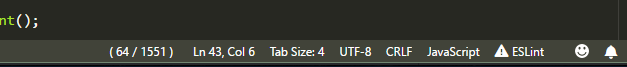
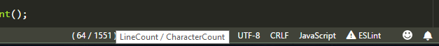

## line-character-count

Visual studio code extension.

### Features
Displays line & character count in the status bar.

Didn't bother to publish this little thing, but if you want to try it, simply download line-character-count-X.X.X.vsix from package folder and under extensions dropdown menu select 'install from VSIX...' and choose the file.

Propably very slow on large files, so maybe have to add enable/disable button in the future.